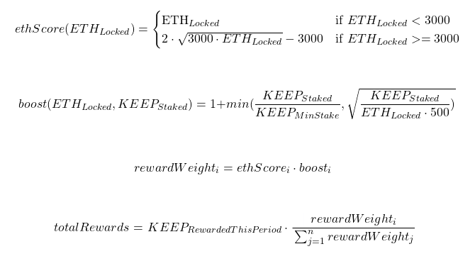

= Staker rewards

ECDSA staker rewards are based on ETH locked and KEEP staked over time. The
rewards calculations are performed weekly off-chain, and committed for
distribution using a variant of Uniswap’s Merkle distributor. This repository
contains scripts for calculating rewards and generation of Merkle tree which
can be used by stakers to claim their rewards for a given interval. Anyone
can use these scripts to validate reward distribution or to generate reward
estimates for a pending interval.

== Algorithm

The algorithm for calculating ECDSA staker rewards as implemented in the scripts 
in this repository is described in this section.

=== Input
* Interval `T` starts at `T_start`.

* Interval `T` ends at `T_end`.

* All operators who have ever deposited ETH into the bonding contract are taken 
  into account.

=== Operator Parameters
For each Operator:

* Calculate the amount of KEEP staked at `T_end` as `KEEP_staked`.

* Calculate the total amount of ETH bonded at `T_start` as `ETH_bonded`.

* Read the amount of ETH unbonded at `T_start` as `ETH_unbonded`.

* Calculate the sum of ETH withdrawn for the entire interval as `ETH_withdrawn`.
  
* Calculate the total ETH under management as 
  `ETH_locked = ETH_bonded + ETH_unbonded - ETH_withdrawn`. In case the operator
  is undelegating OR
  has been de-authorized for the sorition pool in current interval OR
  is not authorized for the sortition pool at the interval start OR
  is not member of the sortition pool at the interval start
  their `ETH_locked = min(ETH_bonded_T_start, ETH_bonded_T_end)`.

=== Requirements

Operator not meeting all requirements listed in this section is not getting any
rewards for interval `T`. Rewards proportional to the operator's reward weight
are deallocated and remains in the pool for future intervals. 

* If the operator does not have `BondedECDSAKeepFactory` contract authorized at
  `T_start`, they are not getting any rewards for interval `T`
  
* If the operator does not have a minimum KEEP stake at `T_start` and is
  not undelegating, they are not getting any rewards for interval `T`.

* If the operator is not in the sortition pool at `T_start` and `ETH_bonded = 0`
  for that operator, they are not getting any rewards for interval `T`.

* If the operator is deauthorized for the sortition pool during the interval
  and `ETH_bonded = 0` for that operator, they are not getting any rewards
  for interval `T`.

* If the operator does not have tBTC sortition pool authorized at `T_start` and
  `ETH_bonded = 0` for that operator, they are not getting any rewards for interval `T`.
  
* If the operator ever committed a fraud, they are not getting any rewards for
  interval `T`. 
  
* If the operator did not meet the signature SLA between `T_start` and `T_end`,
  they are not getting any rewards for interval `T`. For less than 20
  closed/terminated keeps, no more than one could be terminated with a signature
  timeout. For 20 or more closed/terminated keeps no more than 5% could be
  terminated with a signature timeout. Signature SLA does not include not
  answered courtesy calls.
  
* If the operator did not meet the key generation SLA between `T_start` and
  `T_end` , they are not getting any rewards for interval `T` . For less than
  10 key generations, one of them can fail. For 10 or more key generations,
  no more than 20% can fail.
  
=== The Formula



== Generating Reward Distribution
=== Prerequisites

Node.js in version at least v14.3.0 is required to run scripts. We recommend to use
https://github.com/nvm-sh/nvm[Node Version Manager] to get the right
Node.js version with no troubles. You can install this tool by running
`brew install nvm` on macOS or follow the https://github.com/nvm-sh/nvm#installing-and-updating[installation guide]
for other operating systems. To make sure you use the right Node.js version,
you can run `nvm use 14.3.0`.

=== How to run

To verify operator rewards and display summary in a table, run:
```
./rewards-merkle-generator.sh --verify \
    --eth-host <eth_host> \
    --start-timestamp <start_timestamp> \
    --end-timestamp <end_timestamp> \
    --start-block <start_block> \
    --end-block <end_block> \
    --allocation <reward_allocation>
```

This command runs all calculations against mainnet data and displays operator 
rewards in a human-friendly way in a table with numbers rounded to two decimal
places. Rewards are allocated per operator but upon claiming they are transferred
to a beneficiary.

To calculate operator rewards and calculate merkle tree, drop option `--verify`, and run:

```
./rewards-merkle-generator.sh \
    --eth-host <eth_host> \
    --start-timestamp <start_timestamp> \
    --end-timestamp <end_timestamp> \
    --start-block <start_block> \
    --end-block <end_block> \
    --allocation <reward_allocation>
```

Merkle tree output will be written to `distributor/output-merkle-objects.json`.
Allocation for each operator will be written to `distributor/staker-reward-allocation.js`
The script will output information used to calculate rewards for each operator in a tabulated
text format that can be easily imported to a spreadsheet for inspection but is harder to verify
just by looking at the output. 

To enable additional operator authorization checks against Tenderly API, please use:
```
--tenderly-url <tenderly_url>
--tenderly-token <tenderly_token>
```
flags for running the script.

=== Determining block number for a timestamp

In order to determine the block number for an arbitrary timestamp, run:
```
./block-by-date.sh --etherscan-token <etherscan_token> --timestamp <timestamp>
```
The corresponding block number will be returned. We recommend to double-check
the result on http://etherscan.io[Etherscan].
